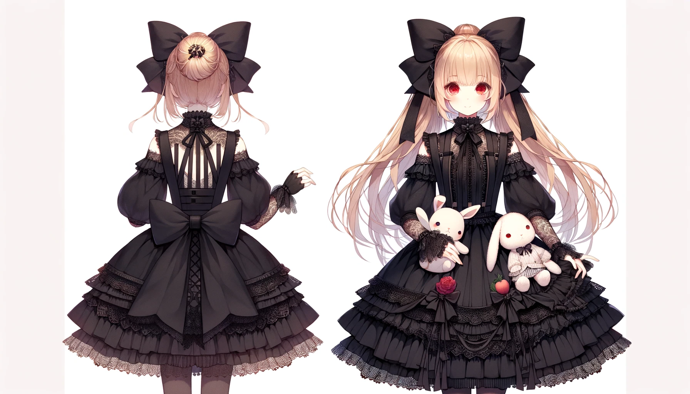
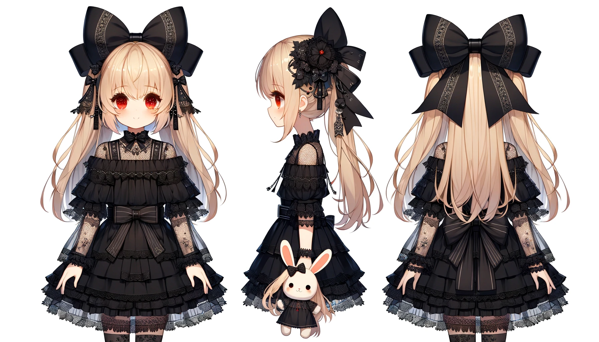

## prompt

A cute girl character with long blonde hair and red eyes, dressed in Japanese gothic lolita fashion, featuring a large black bow on the back of the head. The black dress has lace trim and ribbons, with empty shoulders as part of the design, complemented by arm sleeves and sheer gloves. Include a large black bow visible from behind. The character is holding a rabbit and cat doll. The style should be very detailed and ornate, capturing the essence of gothic lolita fashion with an emphasis on the black color theme. The image should be a full-body portrait, showing the character from the back.

