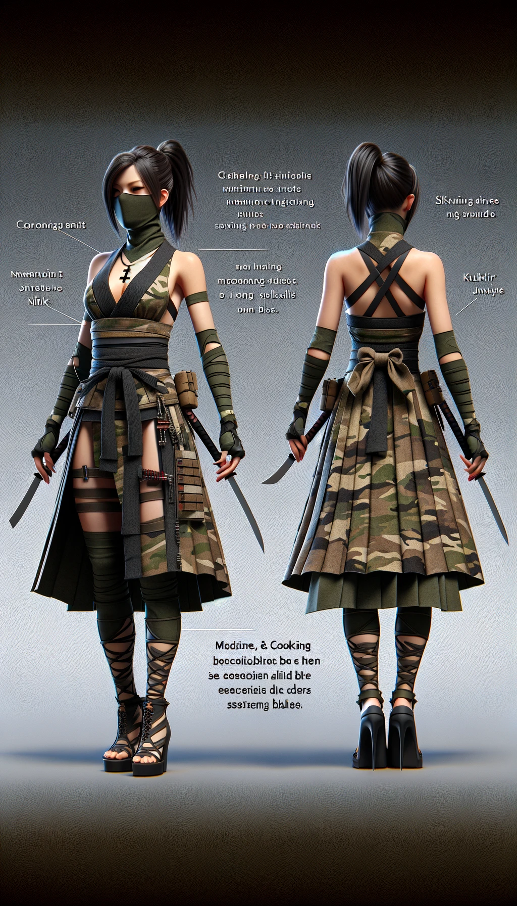
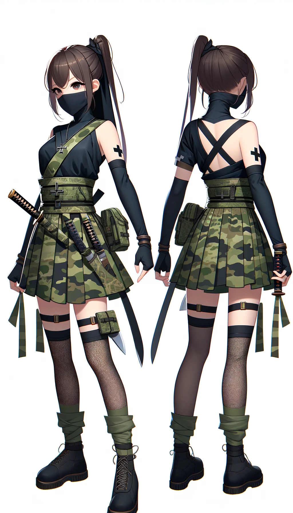

## DALLE3 auto gen prompt

### ver 1

A female ninja character wearing a traditional ninja outfit with a skirt instead of pants, designed in camouflage colors. The outfit does not include a mask. She has a dark, non-reflective cross necklace that signifies her stealth capabilities. Her skills in medicine and cooking hint at her precise handling of blades, aligning with her kukri knife which is a part of her arsenal for espionage and assassination. The image should show the character in both front and back profiles to exhibit her complete attire, focusing on the skirt detail of her ninja costume.

### ver 2

A girl ninja character wearing a traditional ninja outfit with a skirt instead of pants, designed in camouflage colors. She has a black color cross necklace that signifies her stealth capabilities. Her skills in medicine and cooking hint at her precise handling of kukri knife which is a part of her arsenal for espionage and assassination. The image should show the character in both front and back profiles to exhibit her complete attire, focusing on the skirt detail of her ninja costume.