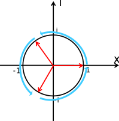
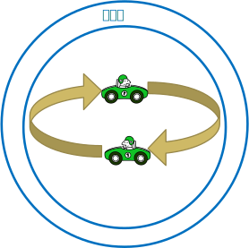
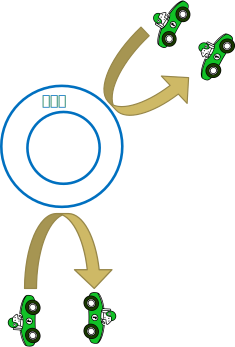

*其實就在眼前，明明就在伸手可及的地方，但那距離卻總讓人覺得像是永遠。*  

<i>−−《櫻花莊的寵物女孩》</i>

*不幸啊*  

<i>−−上條當麻《魔法禁書目錄》</i>

# 特殊結構
## 第二內圍 – 虛空層
虛空層並不是因為虛無一空而稱為虛空層，而是這裡由虛數空間構成的一層。  
此層的分界並不是以xyz三維座標作為分界，而是以第五維i 虛數作為分界。  
因為是虛數世界，虛數介質無法帶出虛空層，怪物的生成也是由虛空世界隨機產生，比如虛空瑪莉羊可能掉落虛空羊毛和虛空羊翅膀。  
這些虛空掉落物可以在交換樓轉換成虛空介質，或把虛空介質交換為消耗品。  

  * 通道界 (i = 0)：
    * 連通中層與異界層的位置。  
  * 鏡像界 (i < 0)：
    * 虛樓界每一樓訊息會映射到鏡像界，不用擔心在虛樓界死亡，可以從最近的一樓拿回狀態。  
  * 虛樓界 (i > 0)：
    * 因為是虛數世界，每0.1為單位樓，樓每往爬上怪物會變強，樓層數量沒有上限，所以怪物強度也是沒有上限。  
      每0.5樓會遇到物質交換樓，可以將打倒怪物的掉落物換成虛空介質，在此補充資源補品，或將虛空介質用在強化自身裝備身上，亦可將虛空介質轉化為藥水。  
      每1樓鏡像界會有虛樓界的鏡像資訊，所以可以從到達過的每1樓出發，亦不用擔心死亡。  
      因為是虛空空間，無法退回前0.1樓，只能透過死亡離開，虛空物質會直接揮發。  

## 第二內圍 – 特殊層
第二內圍的世界邊界，只能透過分析推測出大概的樣貌，第二內圍任何事物皆無法到達  

特殊層也是虛數結構的複數空間，原理是虛數空間的棣美弗定理(De Moivre's formula)。  
從任出發，會走到任何下一個複數空間中的解。  
比如從 x^3 = 1 的 1出發，往前進會到 cos θ + i sin θ (θ = 120° )，再往前進會到達 (θ = 240° )，繼續往前進則回到了原點 (θ = 360° = 0° )。  

所以裡面的物質是無法離開  

同理，外面的物質也是無法進入  

上一篇[一般結構](../General), 
回到[目錄](/Handbook/#ch-3-god-view), 
下一章節[人物狀態](../Attribute)

 PosetMage 
