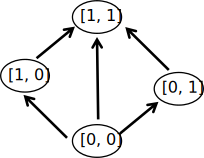

*這個世上有些事你永遠不該知道*  

<i>−−《丹特麗安的書架 》</i>

*你從什麼時候開始產生了我沒使用鏡花水月的錯覺*  

<i>−−藍染《死神》</i>

# Partially Ordered Magic由來

## 什麼是partially ordered set
首先要先介紹partially ordered set，這是數學上的一個集合，也是有向圖。  
任兩個點如果有關聯，必定存在方向性，而方向性不可能反轉。比如 15 < 30 而 1 < 15 必定 不存在 30 < 1的方向。  
所以稱之為偏序(只有一個方向)，如下圖。相對於有些圖可以反向或雙向甚至可以形成循環之類的，在偏序集內都不會發生。   

## 何謂partially ordered magic
遊戲中你不可能在沒學前置魔法的情況就學高階魔法，所以partially ordered magic即技能樹

## ICON 演進歷史
 * Magic + partial order+地水火風四色
   * 
 * 中心部分使用六角形當作魔法寶石
   * 
 * 嘗試只用六角形魔法寶石
   * 
 * 中空菱形當魔法寶石
   * 
 * 改變比例
   * 
 * 六角形魔法寶石、中空圓形
   * 
 * 加回原本的箭頭
   * 
 * 簡化改為中空菱形
   * 
 * 捨棄箭頭的身體
   * 
 * 隨意上個色
   * 
 * 地水火風四色放到寶石位置
   * 
 * 完成，當然要來畫個技能樹圖
   * 

## 設計師重新基於地水火風概念設計新的圖案
   * 

## 縮短詠唱
* Partially Ordered Set 有正式縮寫po-set
* Partially Ordered Magic 縮短詠唱為 PosetMage
* 長型Icon非目前主流
* 再將設計師的ICON套入原本的POM設計
* 新LOGO登場：

上一章節[信仰技能](../Ch3/Faith), 
回到[目錄](/Novel/Setting/#appendix), 
下一篇[其他工具](./Tools) 