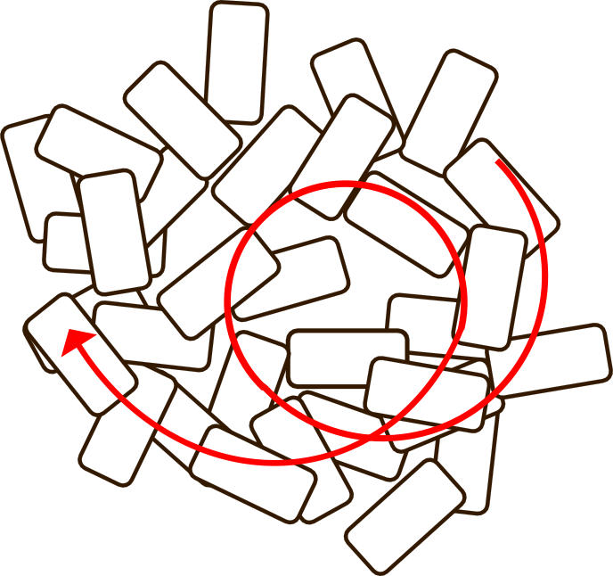
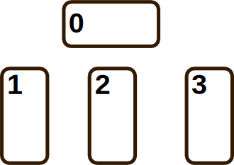

*命運，全部都是必然的嗎？*  

<i>−−時崎狂三《約會大作戰》</i>

*El Psy Kongroo*  

<i>−−岡部倫太郎《命運石之門》</i>

# 某商人的初次占卜
陰暗的房間裡，有一張蠻大的桌子，桌上擺著骷髏頭，點著三盞蠟燭，桌上用絨布覆蓋著，似乎是相當平滑的絨布，絨布上面似乎有一些盧恩文字，應該是用在強化預言的能力。   
桌子的兩側坐著兩個面對面的人，一邊是帶著斗篷，看不是很清楚臉。另一邊則是普通的商人，身穿方便活動的大衣。   
占卜師：「今天想要占卜什麼事情?」   
客人：「有三件事情想占卜，第一件事情是工作上的，詢問最近感覺生意不是很順利，未來要往什麼方向努力。 」   
占卜師：「另外兩件事情呢?」   
客人：「第二件事是想問我女兒去年開始成為了冒險者，但似乎對於隊友不是很滿意，有不少抱怨，但是隊友似乎又很可靠，目前為止接任物都有解決，對於要不要換隊友相當猶豫。」   
客人：「第三件事是想問上個月寵物死亡了，想考慮養一個新的寵物，但是之前的寵物算是蠻容易嫉妒我跟其他動物接觸，現在養新的寵物會被接受嗎?」   
占卜師： 「這三件事情你是要單純占卜還是發動預言來看未來?」   
客人：「商業的事情只是心裡過不去想找個啟發，寵物的事情算是希望讓心中有一個踏實的答案，這兩件事情占卜就好。」   
客人：「女兒的事情由於比較複雜，我也無法介入，這件事我想啟用預言。」   
占卜師：「看來工作事情你心中算是有底，我們就用時間之流牌陣。寵物的事情是跟亡者對話，我們就用八芒星牌陣。   
預言牽涉比較複雜，要使用所羅門之星牌陣處理。加上要發動預言，還需要用上盧恩文字的和鍊金物品，加上女兒的事情因為不是你本人，我還需要動用到自動人形來輔助，所以費用大概是這樣，接受嗎?  
」   
占卜師在小板子上用粉筆寫下收費總額。   
客人：「當然可以，就麻煩你了。」   
占卜師：「再問一個牽涉到個資的問題，因為屬於消費者隱私的部分，你可以選擇拒絕回答或者直接拒絕或者用沉默表示否定。   
因為預言啟用本身要使用增加Entropy的方式，如果你本身會元素魔法或者無屬魔法之類的，或者有信仰之力的話，都能幫助增加Entropy來強化預言效果，你想在預言加入你本身的力量嗎?」   
客人：「我本身會一點氣功用以防身，這樣可以嗎?」   
占卜師：「可以的，到時候再請你發動加入增加Entropy。」  
占卜師：「你以前有試過任何占卜或預言嗎?」   
客人：「沒有，我是第一次來到這種地方，其實主要也是因為女兒的事情才來的，另外兩件事情只是順帶問問。」   
占卜師：「那我來解說一下流程，塔羅牌是有所謂正位逆位的概念，卡片正向和倒向的意義是不同的。   
整個牌陣占卜抽卡須全程由你執行，先洗牌，抽出一張陣眼並且翻開，再洗牌，接著抽出剩下牌陣需要的牌不翻開。直到所有牌陣需要的牌抽完之後，才一次翻開。  
陣眼並沒有正逆位之分，所以是橫擺的。 」   
占卜師：「我先示範一次，洗牌方式是順時針方向以圓形方式將排搓散開，手隨意的在順時針方向上繞打亂牌的方向和順序，一直洗到你覺得夠亂，再把牌疊整齊，打開最上面的一張當陣眼。」   

占卜師邊說明邊將牌組打散，看得出來是很熟練的動作，單手從逆時針方向推回卡牌幾乎就快疊好了，再稍微調整就把牌整理回一疊。   
占卜師：「接著看情況，如果你覺得麻煩，可以不要洗牌改用切牌，隨意的把牌組拿開分成兩疊，再把上疊放到下疊，這樣也是一種洗牌。   
再將牌組做扇形的展開，從展開後的牌組抽一張牌。   

占卜的時候這樣就可以了，如果是要發動預言，因為需要大幅增加Entropy，所以需要你每抽一張就執行搓開洗牌、切牌、從中抽一張。」   
占卜師：「我們就先從結構比較好理解的時間之流陣來擺，牌陣簡單不表示功能簡單，只是選擇不同而已，所以你在三個問題整個儀式過程心態都要保持一致。   
為了讓預言效果比較好，就先讓你熟悉儀式的流程，把女兒的問題放在最後」   
客人：「OK。」   
占卜師：「那就先心中想著你工作上的狀況洗牌，然後抽出陣眼翻開，再依序抽出三張直擺，這三張分別表示過去、現在、未來。」   

客人照著剛剛占卜師示範的，順時針搓開牌組洗牌，繞了幾圈之後， 很明顯只是第一次接觸占卜的新手，用兩隻手小心地把牌堆由左右兩側往內夾，再從上下兩方往中間夾在一起。整理好之後打開上面第一張橫擺，接著拿起一小疊，再把剩下的那一疊疊在這疊上面，接著一樣非常生疏的把牌慢慢推開，稱不上是扇形，比較像是蛇形吧，總之還是推開了。   
最後抽出三張依序由左至右擺放，再打開這些牌。   
占卜師：「陣眼是死神，不要聽到死神就覺得是一張負面的卡，死神可以是帶走的意涵，可能是帶走不好的東西，特別是死神背景有曙光，意味著未來是有希望的。」   
占卜師：「第一張牌是戀人，應該是你的工作上認識的人有愛情，或者跟你有愛慕之情相關的人跟工作有關，不過你都已經有小孩，這本身就是廢話了，結合陣眼死神，可能需要留意一下過去遺失的事物，也可能忽略的甚麼需要維繫的情感。   
客人說：「我現在還是單身，女兒是我領養的。 」   
占卜師：「俗話不是這樣說嗎，女兒是上輩子的情人，這樣說也可以，反正占卜就是這樣的，不用太在意。 」   
客人說：「占卜師這樣說話沒問題嗎 =.= 」   
占卜師：「你想要準就要選預言，不過我個人認為預言也沒有太大意義，預言是一定發生的，任何作為或不作為都無法改變。」   
占卜師：「唯一能做的就是準備好接受它的心態。   
那我們繼續。   
第二張牌是皇帝，或許第一次聽到這張牌會以為是權利或者支配，但是仔細一看國王雖然坐在王位上，卻身穿盔甲，明明常識來說國王一定有是有護衛在身旁，卻還是如此謹慎，可能表示你工作上過度封閉自我。   
客人點點頭說：「我也曾經被對方說過感覺講話太少，他們都說商人不都口若懸河嗎。 」   
占卜師：「皇帝結合死神，是一件蠻妙的事情，可能表示地上勢力和地下勢力的談判拉扯，也可能代表內心有不同的糾結需要解決，解鈴還須繫鈴人，終究是要面對的。」   
占卜師：「第三張牌是魔術師，這張牌是相當正面的，牌中桌上擺著金幣聖杯權杖寶劍，代表著地水火風四元素已經湊齊，萬事俱備，亦不欠東風，結合死神帶著希望的概念，準備好了就該出發往心中的方向前進。」   
客人點點頭說：「我心中是有一些方向了。 」   
占卜師：「接著我們來做跟寵物對話的八芒星占卜。 」   

上一篇[物理學 - Entropy](../Entropy/), 
回到[目錄](/#ch-1-world-setting), 
下一篇[家教課](../Tuition)

 PosetMage 

