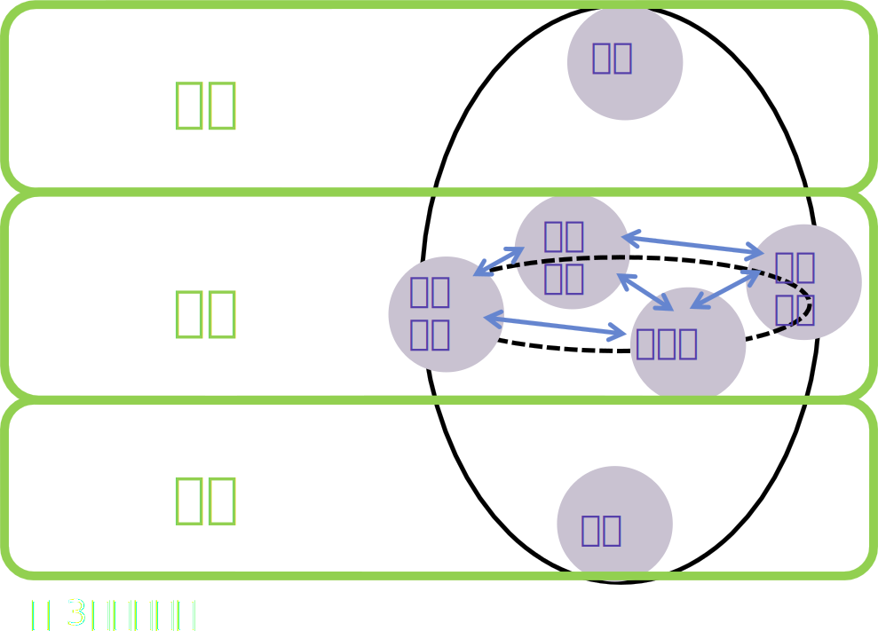
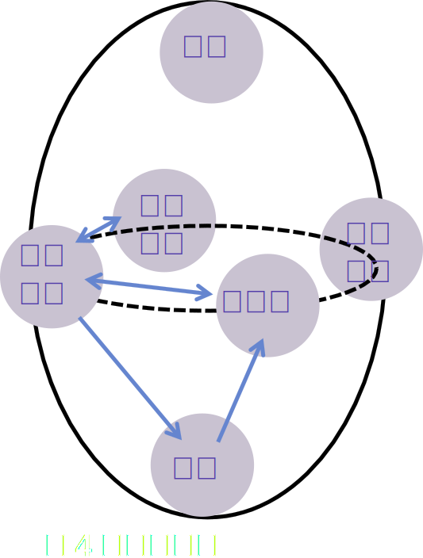

*烏咪沒有犯罪*  

<i>−−《大富翁4》</i>

*悠遠的天空，在蒼穹的盡頭。*  

<i>−−《緣之空》</i>

# 推測世界樣貌
目前認為世界是由三層構成，凱茵茲．法蘭 將其分類為上中下三層(圖3)。   
 

各層有數個界，比如中層有西方大陸界、未踏域界、大陸盡頭界、浮空島界。而下層目前已知的只有下界。   
上層只是由地質學家和考古學家歷史學家共同推論出來存在的一層，目前猜測至少有神界。  
  
各層之間有著Entropy邊界影響，所以無法隨意穿越各層。即使是現在已經開發出通往下界的方法，也是單行道，還要從另一個單行道回來。   
中層與上層或許可以在大陸盡頭界突破Entropy邊界製造與神界往來的通道。不過這樣做並沒有好處，畢竟傳說中層各界曾經被神族統一過。  
至於為什麼神族又退出了中層並沒有人知曉，坊間流傳的說法是因為中層有世界末日的預言，所以他們提早避難了。現在沒有神族的中層其實很接近世界末日。  
在我看來只是無稽之談，如果他們是為了提早離開躲避世界末日，為何這麼長的一段歷史都還沒有出現大災難，反而近代更和平了。  
  
中層的西方大陸界土地面積最大，也是人們目前最常活動的範圍。   
不過交通最發達的並不是西方大陸界而是浮空島界，因為浮空島界都是大量的飄浮島嶼，自然需要各式各樣的交通和通訊技術。也因此浮空島界是商業中心。   
也多虧於浮空島界開發出優異的交通技術，在三界往返只是時間的問題。通常三界是指下界、西方大陸界、浮空島界(圖4)。   
 

由於大陸盡頭界並沒有值得特地作為活動據點的優勢，基本上都是學術團體才會去大陸盡頭界做學術研究。加上那邊或許存在與神界溝通的可能，各國都有派駐警備在那邊警戒，沒事跑去那可是會被當可疑人物吃不完兜著走。   
中層還有一界比較少人提的是未踏域界，由於附近有大量的強力魔物，即使有人試圖在附近建立據點也會被進攻或偷襲破壞。  
建議準備充足才開始進入這個域界，根據之前嘗試探索的菁英報告，或許有類似地下城的結構。此處魔物貌似有智慧與統領者的存在。但是連探索此區域都是一大難題。有人猜測是沒回歸神界的神族在此區深處。   
  
我認為這個可能性很高，畢竟如同前面說的，神族並沒有特地退回神界的理由，甚至我個人猜測，除了大陸盡頭界，其實未踏域界也存在通往神界或者與神界溝通的方法。   
中層介紹差不多到此，下層的理解反而比未踏域界還多。下界是開發時間較短的世界，似乎有豐富的礦產資源，有多樣化的開採。如同前述，已經開發出交通技術，可前往浮空島並且從西方大陸進入下界，科技和各種文化都有流入下界。最原始到底是精靈還是矮人是原本住民已經不可考。   
目前下界跟浮空島一樣都是都是中立地帶。   
  
可別傻傻地以為開到公海只有飛空艇註冊的國家可以抓罪犯，在中立地帶的法則是冒險者警備隊有抓罪犯的權利，再由國際法庭引渡，畢竟浮空島界有相當發達的通訊技術要跟各國溝通可是相當快的，就算躲避了冒險者抓捕也會快速被通緝。   
*−−雪莉．法蘭《世界長這樣？》*  

上一篇[某商人的日記](../Diary), 
回到[目錄](/SettingBook/#ch-1-world-setting), 
下一篇[圖書館抄書](../Manuscript)

 PosetMage 

