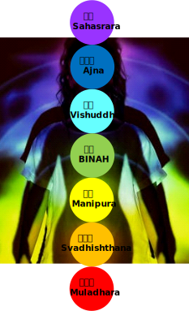

*看我跳躍 天之銀嶺*  

<i>−−《魔術士歐菲》</i>

*ルーラ*  

<i>−−《勇者鬥惡龍》</i>

# Cakra
 

# 穿雲眼
強化眉心輪 (Ajna)，就能開啟第三隻眼，感知戰場中敵人的技能。

# 蜉蝣術
強化臍輪 (Manipura) ，獲得肉體超越普通人的能力，以至於可以在水上或水下行走。

上一篇[塔羅牌陣](./Tarot), 
回到[目錄](/SettingBook/#ch-2-documentation), 
下一篇[元素精靈](./Elementals)