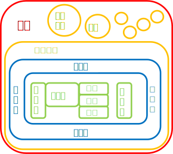
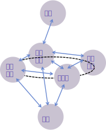

*NOT EVEN DEATH CAN SAVE YOU FROM ME*  
*(即使死亡也無法讓你逃脫)*  

<i>−−Diablo《暗黑破壞神2》</i>

*只要是活著的東西，就算是神也殺給你看*  

<i>−−兩儀式《空之境界》</i>

# 世界結構
## 外圍世界:
最大的集合，外圍世界內有多個內圍世界，內圍世界數量龐大。  

## 內圍世界:  
每個內圍世界有各自的運作法則，內圍世界之內各層遵循相同法則。  
內圍世界之間有維度等級之分，高維度的內圍世界或許可以影響維度較低的內圍世界，低維度內圍世界幾乎不可能影響高維度的內圍世界。  

### 第二內圍
Partially Ordered Magic的故事大部分發生在第二內圍。  
各世界之間通行的可能性實際上是如下圖：  

上一章節[雜文](../Ch2/Docs), 
回到[目錄](/SettingBook/#ch-3-god-view), 
下一篇[一般結構](./General)